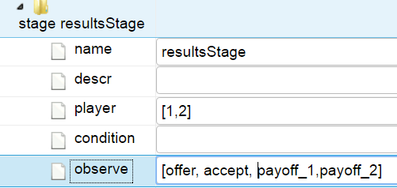
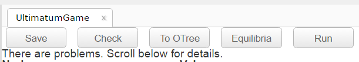

# gtree: Game-Theoretic Representation of Economic Experiments

Author: Sebastian Kranz, Ulm University

Date: 2017-08-28

## Overview

gtree is an R package with a shiny-based web GUI that allows to develop, to conduct and to game theoretically analyse economic experiments. The experiments run on a webserver, and can e.g. be conducted in a lecture hall, where students participate via smart phone.

There already exists two great toolboxes to develop and run economic experiments:

  1. The classic [zTree](http://www.ztree.uzh.ch/en.html), created by Urs Fischbacher (2007). It is very flexible and has allowed to realize thousands of economic experiments in economic laboratories all around the world.
  
  2. The newer [oTree](http://www.otree.org/), created by Daniel Chen, Martin Schonger and Chris Wickens (2016). Experiments can be specified in Python with Django and are conducted via the web. Like with gtree, subjects can participate with almost any device that can browse the web. 

gtree is structured with the goal in mind that typical multi-stage experiments can be created fairly easily and quickly. It should be simple enough such that most economics students are able to enter such experiments as part of a seminar paper.

While not yet fully implemented, in a not-so-distant future version, there will be flexibility to specify all sorts of more complicated experiments, like real-effort games or real time auctions. Whatever you will be able to program with R & Shiny or Javascript can in principle be a part of an experiment, similar as oTree allows to employ the full flexibility of using Python & Django and Javascript.

Overall, developing and running experiments in gtree differs in some aspects, but not in too many aspects, from the two existing toolboxes.

The main contribution is that typical multi-stage experiments are entered in a format that allows direct conversion to a game tree. Hence, you specify an experiment in a form that is similar to zTree or oTree but you can immediately also perform game theoretic analysis. 

You can solve equilibria for standard preferences (risk-neutral money maximizer) or specify some other preferences like inequity aversion or loss aversion.

While gtree also has a rudimentary internal pure strategy SPE solver, it mainly uses [Gambit](http://www.gambit-project.org/) (by Richard McKelvey,  Andrew McLennan und Richard D., McLennan, Andrew M., and Ted Turocy, 2016) to compute the equilibria.


The possibility of easy game theoretic analysis, can e.g. be helpful for...

  - the analysis of the experiment when comparing observed behavior with game theoretic predictions.
  
  - the development of the experiment, e.g. to search for parameters that will yield nicely separated game theoretic predictions for different treatments.
  
  - meta studies that compare a large number of economic experiments from a game theoretic perspective

# Tutorial: An Ultimatum Game Experiment

## 1 Create a new game

In the left panel of the gtree explorer, you see a list of all games specified in your project. To create a new game, *right-click* right on the "Games" folder (or any existing game) and choose the "New Game" option in the context menu:


Then a window opens that asks you to enter a name (gameId) of the game. We pick "UltimatumGame" and press Ok. Note that a gameId can contain only letters and numbers, no spaces nor underscores _. That is because underscores are used in identifiers for different game variants.  


Then a tab opens in the main window that contains a tree with the initial game structure.


## 2. Add new parameters
 
We first open the node "Variants, Params". We see a table in which we can specify different parameters (columns) and different variants (rows) for the game.
The parameter "numPlayers" is given and by default set to 2. If your game has a different number of players, you can change it simple by clicking on the cell and changing the number.

To add or remove parameters or variants, we right click on a table cell and pick the corresponding option to insert or remove columns or rows.


We want to add a new parameter "cake" that specifies the size of the cake that can be split between the propose (player 1) and responder (player 2). So we right click on the cell "numPlayers" and pick the option "insert column on the right".

We enter the parameter name "cake" in the title row and the value of the parameter in the row for our only game variant "base"


Here, we have set the cake size to 10. 

## 3. Save Game

It is useful to save your game from time to time. To do so, simply press the "Save" Button.


## 4. A glimpse on the file structure

The game files will be saved in the folder

\<projectdir\>/games/\<gameId\> 

That folder is automatically generated, when we create a new game. You can have a look at this folder in a file explorer


The subfolders "eq","gambit" and "pages" are currently all empty:

  - "eq" will contain files for computed equilibria
  
  - "gambit" will contain gametree representations in Gambits "efg" format
  
  - "pages" will contain customizable markdown files that specify how the stages are shown to subjects.
  
The file "UltimatumGame.json" contains the game specification as a .json file. It currently looks as follows:

    {"game": {
        "gameId": "UltimatumGame",
        "gameInfo": {
            "label": "",
            "tags": "",
            "descr": "",
            "articles": "",
            "variantOf": ""
        },
        "varpar": [
            [
                "variants<U+2193> params<U+2192>",
                "numPlayers",
                "cake",
                "descr"
            ],
            [
                "base",
                "2",
                "10",
                "The base variant"
            ]
        ],
        "stages": [
            {
                "name": "actionStage1",
                "descr": "",
                "player": "1",
                "condition": "",
                "observe": "",
                "nature": [],
                "compute": [],
                "actions": [],
                "special": {
                    "beliefs": [],
                    "freetext": []
                }
            },
            {
                "name": "resultsStage",
                "descr": "",
                "player": "[1,2]",
                "condition": "",
                "observe": "[payoff_1,payoff_2]",
                "nature": [],
                "compute": [
                    {
                        "name": "payoff_1",
                        "formula": "=0"
                    },
                    {
                        "name": "payoff_2",
                        "formula": "=0"
                    }
                ],
                "actions": [],
                "special": {
                    "beliefs": [],
                    "freetext": []
                }
            }
        ]
    }}

In principle, you could specify games by manually adapting this json file. Using the gtree explorer should usually be much more convenient, however. Nevertheless, directly modifying the json file may be useful in some situations, e.g. to quickly change variable names via find and replace with a text editor.

## 5. Specifying the offer stage

We now go to the stages and open the automatically created stage with name "actionStage". We adapt it as follows:


1. We first change the stage name to "offerStage".

2. We then enter a short stage description in the field `descr`. Stage descriptions are optional and is only used for experimenters to better understand the structure of the experiment.  

3. We set the `player` field to 1, since only player 1 will see this stage and act in it.

4. We keep the field `condition` empty, it will be explained in later examples.

5. Also the field `observe` is empty, since there is nothing yet to observe. Note that parameters are automatically assumed to be known to all players, i.e. players should be given that information in the instructions. 

### Adding the action "offer"

Then we add an action: we right-click on the tree element "actions" and choose the menu item "Add action" and enter the following specification:


<ol>
<li>We call the action "offer".</li>

<li>The field `set` specifies a finite set of choices, i.e. possible values of offer.

We have entered a formula:
  
`=0:cake`

Reminiscent of popular spreadsheet software, a field that starts with an equal sign ("="), will be typically be parsed as an R formula. The command `0:cake` is R code that generates a sequence of integer numbers between 0 and the value of our parameter `cake`.

If we would have always fixed the cake to some specific size, e.g. 10, we could also have entered the action set as a list in a non-formula format: 

`[0,1,2,3,4,5,6,7,8,9,10]`

However, using R formulas allows much more flexibility and games can be adapated much quicker.
</li>
<li>
The fields `strategyMethodDomain` and `labels` are not required here, and we leave them empty.
</li>

## 6. Specifying the accept stage

We now add a new stage. We can do this by right-clicking on the tree element of an existing stage or the parent element `stages` and picking the corresponding context-menu item:


We then first enter the following specification:


<ol>
<li>The stage name is "acceptStage"</li>

<li>The value of the field `player` specifies that this stage is only shown to player 2 and only player 2 performs actions.</li>

<li>In the field `observe` we enter the value `[offer]`. This means that player 2 observes the offer that player 1 has chosen in stage 1.

Note that the specified observations determine how the information sets in the game tree are constructed. If player 2 would not observe the variable offer, we would have quite a different game. 

Note: If only a single variable is observed, the squared braquets that indicate are list of variable are optional, and we could also simply have entered `offer`.

In principle, we also could enter an R formula in the observe field. We then would need to write `="offer"`, i.e. the variable name must be quoted as a string. However, if possible try to avoid to enter observations as an R formula. Formulas can be evaluated differently depending on previous actions or moves of nature. Yet, if observed variables depend on the context, it is more difficult for gtree to automatically generate page templates to and correctly export the code to oTree. At least in the current version of gtree, you get a warning if you enter a formula in the field observe.

</li>
</ol>

### Adding the action "accept"

We now add an action (right-clicking on `actions`) with the following specifications:


<ol>
<li>We specify `accept` as a dummy variable, i.e. it has the a fixed set `[0,1]`. Instead of the list notation, we could equally well write the R formula `=c(0,1)` or `=0:1`. These different notations would not make any noticable difference here.

We could also have defined the set using strings, e.g. `[reject, accept]` or in R formula notation `=c("reject","accept")`.

One could also use a set of logical values: `[FALSE,TRUE]` or in R formula notation `=c(FALSE,TRUE)`.

So far I have not yet a strong intuition, which formulation (dummies, strings or logical values) seems most adequate, so I would leave it as a matter of taste. Maybe after more experience, I will develop a style guide that makes a recommendation, since there a clearly benefits if similar experiments are similarly specified.

</li>

<li>We also specify the field `labels` with the values `[reject, accept]`. There should be one label for each element of the set. Labels are optional, but can facilitate the generation of pages and may also be useful in data analysis. One can also enter an R formula as labels, which returns a string vector, e.g. `=c("reject","accept")`.</li>

</ol>

## 7. Specifying the results stage

Finally, we specify the results stage. We adapt the already given results stage:



<ol>
<li>The stage will be shown to both players. This does not mean that the stage must be shown in the same fashion to both players. We can manually differentiate the shown page for both players, by adapting the page definition of this stage (discussed later).

Alternatively, we could also specify separate result stages for each player. Whether to differentiate at the stage or page level is mainly a matter of taste.
</li>
<li>Each player observes all variables and the payoffs. The payoffs will be specified in this stage below.
</li>
</ol>

### Specifiying payoffs

Besides actions, we can specify moves of nature, i.e. random variables, and compute deterministic transformations of other variables in a stage. Payoffs are deterministic transformations named `payoff_i` where `i` is the player number. To conduct a game theoretic analysis, the payoff variables must be specified. Here we specify payoffs as following:


<ol>
<li>The payoffs for player 1 (proposer) are given by the following simple R formula:

`=(cake-offer)*accept`

`cake-offer` is the amount that the proposer would like to keep for himself. Yet, she only gets this amount if the responder accepts the offer (accept=1), otherwise she gets 0.

Often, payoffs will require more complicated case distinctions. For a convenient formalizations, one can use the R function `cases` that is defined in the gtree package. Using the function `cases`, the R formula for `payoff_1` would look as follows:

```
= cases(
accept==1, cake-offer,
accept==0, 0
)
```
where conditions and returned values alternate as function arguments.
</li>
<li>The payoffs for player 2 are similarly specified by the formula

`=offer*accept`
</li>
</ol>

## 8. Check the game specification

Let us first save the game by pressing the "Save" button.

The also press the "Check" button. This goes through your specifications and checks for errors. If everything is alright, you should get a result as follows:


To test the check function, I add a mistake in the set definition of the `offer` action. You then get a message that errors have been identified:



You can the scroll down the tree to find the specific location of the error(s) with a more detailed message:


This error message is forwarded from the R evaluator, that is why we read the line `Error in eval(expr, envir, enclos) :` that may look cryptic to you. However, the subsequent information `object 'Cake' not found` should tip you off what is wrong: 

We have specified the paramater `cake` in lowercase letters, hence R does not know the variable `Cake` when it tries to compute the offer set.

Note that pressing the "Check" button may not detect all errors in your game. One reason is that some errors may only be detected with relatively time consuming computations. For example, you have to make sure that a variable with the same name is not assigned twice in an experiment. This does not forbid that a variable is defined in multiple stages. Yet those stages must be run under mutually exclusive conditions. Testing whether stage conditions are mutually exclusive, may be quite time consuming in large games, however, and is therefore not performed when the check button is pressed. Some errors may pop up later when a test run is conducted. I hope that the "Check" button catches most errors, however.

## 9. Game theoretic analysis

We have now already entered a version of the ultimatum game that allows game theoretic analysis and to conduct the experiment. To perform the game theoretic analysis, press the button "Equilibria". A new tab with a screen like the following will open (I have to improve its design at some point):


### 9.1 The game tree

Before solving for equilibria, we compute the game tree by pressing the "Gametree" button. We see the following summary information:


The game tree has 22 different outcomes and 12 different information sets (1 for player 1 and 11 for player 2).

More interestingly, the normal form representation of this game has 22 528 different strategy profiles. The number of strategy profiles is the product of the number of moves of all information sets. Here that product is $11 * 2^{11}$.

While 22 528 strategy profiles are still easily tractable, the number already suggests that normal form games from typicial experiments can be very big. For example, if the cake size would be 100, the normal form game would have $101*2^{101}$ different strategy profiles, which is a number with 32 digits. Non-surprisingly a main obstacle in numeric game theoretic analysis can be the curse of dimensionality: many games are just too large to analyse.

One useful and common method to reduce complexity is to split the game into subgames and solve them via backward induction. Here we can split the game into 12 subgames (each information set starts an own subgame, yeah!). Solving the game via backward induction requires to effectively only considers 33 strategy profiles. Even with a cake size of 100, the game remains very tractable via backward induction.

Unfortunately, many games with imperfect information don't have many proper subgames. One direction for future development of gtree are heuristics that allow to handle certain large games that cannot be decomposed into sufficiently small subgames.

Take a look at the game directory

\<projectdir\>/games/\<gameId\>

We have two new files "UltimatumGame.rg" and "UltimatumGame_base.tg" that contain different internal representations of the game. These files contain serialized R objects and should not be manually altered. More interesting is the subfolder `gambit`, which contains the file `UltimatumGame_base__payoff.efg`. This is a text file that contains the game tree of the base variant of our ultimatum game in the Gambit extensive-form game format.

You can open the file with Gambit to have a look at the game tree (for games with too many outcomes Gambit will most likely hang up, however). A screenshot looks as follows:


### 9.2 Compute subgame perfect equilibria

To compute all pure strategy subgame perfect equilibria of our ultimatum game, simply click the button "Solve".  

If keep the default item "All pure SPE (Gambit)" in the select box "Solve for", gtree uses the Gambit command tool `gambit-enumpure` to solve for all pure strategy SPE. You can also user different Gambit solvers, e.g. if you are interested in mixed strategy equilibria. A list of the Gambit solvers is found here:

<a href="http://www.gambit-project.org/gambit15/tools.html" target="_blank">http://www.gambit-project.org/gambit15/tools.html</a>

You can also select an internal solver from gtree to solve pure strategy SPE. Yet, for most games the Gambit solver is faster and requires less memory. (Still, there are some games for which Gambit's enum-pure solve seems to be quite slow, while gtree's internal solver works considerably faster.)

As result, we first get 3 aditional lines in our summary table.


The Ultimatum game has 2 different SPE which also have different equilibrium outcomes, and it took around a second to solve the game.

Another table shows the equilibrium outcomes:


In one equilibrium outcome player 1 offers 1, which is accepted, and in the other outcome she offers 0, which is accepted.

The equilibria themselves specify a move for every information set, i.e. it also specifies which offers off the equilibrium path are accepted. For example, you can deduce that in the first equilibrium an offer of 0 will be rejected, since otherwise the proposer would have offered only 0. By default, in the GUI we currently only show the equilibrium outcomes, however.

Deeper equilibrium analysis can be performed directly via R.

There is a also a table "Expected equlibrium outcomes". Since we have no random moves of nature in our Ultimatum Game, that table is essentially the same as the equilibrium outcomes table, however.

### 9.3 Computing SPE for inequity averse players

Economic experiments have fueled a vast literature on alternative preferences and decision heuristics that deviate from the assumption of a risk-neutral maximizer of own expected monetary payoffs.

It would be nice if gtree could also solve games under the assumptions of important alternative behavioral models. Currently, there is only the option to specify different outcome-based preferences.

One example, are inequality aversion preferences defined by Ernst Fehr and Klaus Schmidt (1999). In a two player game, player i's utility is given by:

$$u_i = \pi_i - \alpha \min (\pi_j-\pi_i) - \beta (\min (\pi_i - \pi_j)$$

where $\pi_i$ and $\pi_j$ are the two player's monetary payoffs. The parameter $\alpha$ measures how envious a player feels if the other player has a higher payoff. The parameter $\beta$ measures the degree of experienced guilt when a player has a higher payoff than the other player.

# Preferences

gtree has a few classes of preferences prespecified. So far, we only have implemented output based preferences, i.e. simply transformations of the game's monetary payoffs.

### payoff

Players are risk-neutral and want to maximize their expected payoff.

## Social preferences

The core idea of social preferences is that players do not only care about their own payoffs but also about the payoffs of others. Reasons could be emotions like envy or guilt, or moral attitudes like altruism.

### ineqAv: Inequality Aversion

Inequality aversion preferences as defined by Ernst Fehr and Klaus Schmidt (1999). In a two player game, player i's utility is given by:

$$u_i = \pi_i - \alpha \min (\pi_j-\pi_i) - \beta (\min (\pi_i - \pi_j)$$

where $\pi_i$ and $\pi_j$ are the two player's monetary payoffs. In an n-player game, players compare to all other players in a similar fashion.

The parameter $\alpha$ (alpha) measures how envious a player feels if the other player has a higher payoff. The parameter $\beta$ (beta) measures the degree of experienced guilt when a player has a higher payoff than the other player.

### envy:

This class of preferences is like inequality aversion with the guilt parameter $\beta$ fixed to 0. So players only dislike higher payoffs by other players but don't feel guilty when they have more.

## Aversion against risks

Experiments show that many subjects exhibit considerable aversion against small stake risks. (Even though, I guess a substantial fraction of those subjects also participate in lotteries...). This is add odds with the assumption of risk-aversion over life-time income, which would imply almost risk-neutrality in small stake experiments (see Rabin, 2000).

Loss aversion preferences are a prominent choice to model such aversion over small stake risks. People have one or multiple reference points. They feel gains, when they get a higher payoff than their reference point and they feel losses, when they get lesss. It is assumed that losses loom larger than gains, which makes people averse against risky gambles that can lead to outcomes below and above the reference point.

The tricky issue, of course, is how to define the reference point(s).

In games with more than 1 player, I think that envy preferences can be nicely interepreted as a form of loss aversion preferences. Players take the payoffs of other players as reference points and feel a loss of $\alpha \min (\pi_j-\pi_i)$.
If there are multiple players, the payoffs of other players may be natural cd

## lossAv: Loss aversion with a fixed single reference point

Loss aversion with a single reference point $r$. Player i's utility function is given by

$$
u_{i}=\begin{cases}
\pi_{i}-r & \mbox{if }\pi_{i}\geq r\\
-\lambda(r-\pi_{i}) & \mbox{if }\pi_{i}<r
\end{cases}
$$

Gains above the reference point are weighted normally. In contrast losses below the reference point are weighted with the parameter $\lambda > 1$.


Rabin (2000) provides sensible arguments while experimental observations are not consistent with risk-aversion over expected life time income, which would    

# Experiments

- Experiment
  -- Sequences
    -- Parts (a game, questionaire, page or computation)
  
Objects:
  exp
  es (a sequence)
  


# The Vision: A structured experimental economic database

I hope that gtree is in itself useful to develop, run and analyse new economic experiments, as well as, for teaching purposes where experiments are replicated and analysed in a classroom.

My original motivation for developing gtree, however, is to use it as one of several tools to build up a database that contains the data, structure and game theoretic representation of a large number of performed economic experiments. Such a database should facilitate meta studies across a large number of experiments and hopefully provide better insights into economic behavior.

I am not yet sure of the exact further steps towards such a database. Yet, some ideas are the following:

  - Collect experimental data and background data from journal data archives and directly from colleagues.
  - Develop and test a format for Bachelor or Master seminars where students convert these experiments into the gtree format and run some replications and analyses during the seminar.
  - Have a sensible scheme of manually tagging experiments (e.g. "Ultimatum Game Variant", "neutral-framing","market-framing",...).
  - Have functions that automatically characterize and tag experiments and specific actions based on the game theoretic structure (e.g. a two-stage game, an accept-reject action, an action in which higher choices correspond to *nicer* choices, a signalling game,...)
  - Store the data, experimental structure, computed equilibria, tags, etc, in well named git repositiories, e.g. on Github.
  - Create an index database that stores tags and other main indicators for these experiments. Also develop tools with web interface that allow to search and download subsets of experiments from these repositories.
  


# References

- Chen, Daniel L., Martin Schonger and Chris Wickens (2016). "oTree—An open-source platform for laboratory, online, and field experiments." Journal of Behavioral and Experimental Finance.

- Fehr, Ernst, and Klaus M. Schmidt (1999). "A theory of fairness, competition, and cooperation." The Quarterly Journal of Economics 114.3.

- Fischbacher, U., 2007. "z-Tree: Zurich toolbox for ready-made economic experiments", Experimental Economics 10: 171.

- McKelvey, Richard D., McLennan, Andrew M., and Turocy, Theodore L. (2016). Gambit: Software Tools for Game Theory, Version 16.0.0. http://www.gambit-project.org.

- Rabin, M. (2000). "Risk aversion and expected‐utility theory: A calibration theorem."" Econometrica, 68(5), 1281-1292.
